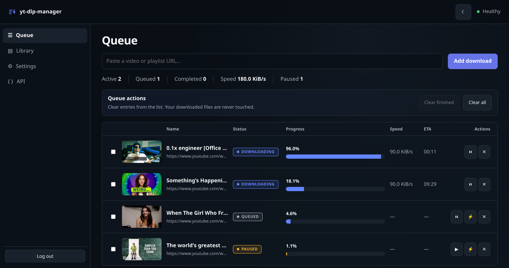
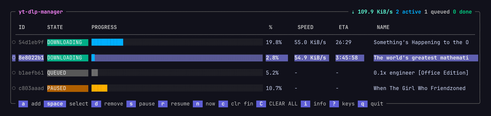

# yt-dlp-manager

A self-hosted download manager for [yt-dlp](https://github.com/yt-dlp/yt-dlp),
shipped as one Go binary with four interfaces over a single shared queue:

- **Web UI** — Queue, Library, Settings and API pages, live progress over
  Server-Sent Events, dark/light/system theme.
- **TUI** — `yt-dlp-manager` or `yt-dlp-manager tui`.
- **CLI** — scriptable `add`, `list`, `pause`, `resume`, `remove`, …
- **Daemon** — headless, same-user Unix socket.

They share one manager and state file; exactly one process owns it at a time.

## Screenshots





## Quick start with Docker Compose

Run the published image — pulls `ghcr.io/ih8d8/yt-dlp-manager`, builds nothing:

```bash
printf 'PUID=%s\nPGID=%s\n' "$(id -u)" "$(id -g)" > .env
make up-prod
```

Or build from this checkout with `make up` instead. Stop either stack with
`make down-prod` or `make down` — run one or the other, not both, since they
share a container name and their config and state volumes.

Open <http://127.0.0.1:8080> and set the administrator password when prompted.
There is no default password — only a salted verifier is stored. The port is
bound to loopback; put a TLS reverse proxy in front for remote access, set
`YTDLP_MANAGER_SECURE_COOKIE=true`, and disable proxy buffering for
`/api/v1/events`.

The setup screen asks for a **setup token** whenever the request does not come
from the machine running the server — which includes the container case, since
Docker's port proxy is what connects. Read it from the log and paste it in:

```bash
docker compose logs yt-dlp-manager | grep 'setup token'
```

The token is generated at startup, changes on every restart, and stops working
once the password exists. It is what stops anyone else who can reach a fresh
instance from claiming the administrator account before you do.

Compose mounts `~/Downloads/yt-dlp` for media and named volumes for config and
state. Both compose files ship with `YTDLP_MANAGER_ALLOW_YTDLP_CONFIG_EDIT=true`
so you can point downloads at `/downloads` from **Settings → Downloads** on the
first run; set it to `"false"` afterwards if you would rather nobody with an
admin session could change where files land. Running the binary directly, it
stays off unless you ask for it.

The image bundles yt-dlp (pinned and checksum-verified), ffmpeg and QuickJS for
YouTube's player challenges. Nothing is fetched at runtime. To swap the JS
runtime: `docker build --build-arg JS_RUNTIME=deno .` (`quickjs`, `deno`, `node`).

### Container security

Runs as `PUID:PGID`, never root — the entrypoint is root only long enough to
chown its volume roots, then `su-exec`s down, and the app process holds **no
effective capabilities**. `cap_drop: ALL` (only `CHOWN`/`FOWNER`/`SETUID`/
`SETGID` added back for that step; `DAC_OVERRIDE` deliberately not granted),
read-only root filesystem, `no-new-privileges`, and `/tmp` mounted
`noexec,nosuid,nodev`.

## Build and run locally

Requirements: Go 1.27+, `yt-dlp`, `ffmpeg`, and a JS runtime on `PATH`
(`deno`, `node`, `qjs` or `bun`) for YouTube. Node 22.12+ is only needed to
rebuild the web UI — the committed bundle in `internal/webui/static` means
plain `go build` works without it.

```bash
make build
./bin/yt-dlp-manager
```

```text
yt-dlp-manager                 open the TUI
yt-dlp-manager server          run the web UI and API
yt-dlp-manager daemon          run the Unix-socket manager
yt-dlp-manager add [URL|-]     add a URL ('-' reads stdin; default: clipboard)
yt-dlp-manager list            show downloads
yt-dlp-manager pause ID        pause, keeping partial files
yt-dlp-manager resume ID       re-queue a paused download
yt-dlp-manager start-now ID    prioritize now (at most 8 above the concurrency limit)
yt-dlp-manager remove ID       drop a row (keeps your downloaded file)
yt-dlp-manager clear-finished  drop completed and failed rows
yt-dlp-manager --help          every command and flag
```

TUI keys: `a` add · ↑/↓ move · `space` select · `s` pause · `r` resume ·
`n` start now · `d` remove · `c` clear finished · `C` clear all · `i` info ·
`?` help · `q` quit.

With no manager running, the default command starts one for the life of the TUI,
and `add` parks URLs in an inbox that drains on next launch.

Windows is not a supported target: the download supervisor uses POSIX process
groups to stop yt-dlp and its children together.

## Configuration

yt-dlp's own config stays authoritative for formats, output paths, cookies,
retries and post-processing; the manager invokes yt-dlp without a shell and adds
only progress-oriented arguments.

Manager settings live in `$XDG_CONFIG_HOME/yt-dlp-manager/config.json`,
overridden by `YTDLP_MANAGER_*` environment variables, then CLI flags. State is
`$XDG_STATE_HOME/yt-dlp-manager/state.json`, socket
`$XDG_RUNTIME_DIR/yt-dlp-manager.sock`.

## License

MIT — see [LICENSE](LICENSE).
